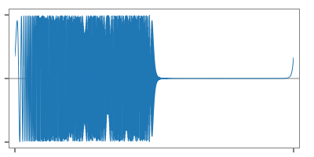

# BodeAnalyzer
 
 

 ## What is this?

PCのオーディオインターフェースを利用してオーディオシステムの周波数特性を解析するためのシンプルなツールです。振幅と位相の応答を得るために、2種類の測定方法を用意しています。  
 This is a simple tool for analyzing the frequency response of audio systems using the PC's audio interface. Two measurement methods are available to obtain amplitude and phase responses.  

 * IR methods
    * using pure impulses
    * using Linear Swept-Sine (OATSP)
    * using Log Swept-Sine (Pink TSP)
    * using MLS
 * Stepped Sweep method

 Implemented with JUCE.

 ## Requirement

* JUCE framework: [download](https://juce.com/get-juce/download), [repository](https://github.com/juce-framework/JUCE)
* Projucer: [download](https://juce.com/discover/projucer), or build from source
* C++ build tools: Visual Studio, Xcode, etc.
* ASIO SDK (optional, Windows only): https://www.steinberg.net/developers/。

 ## How to build

1. Open the .jucer file with the Projucer.
2. Correct the JUCE module path and properties, add exporters and save.
3. Build the generated C++ projects.

## Example

## Written by

[yu2924](https://twitter.com/yu2924)

## License

CC0 1.0 Universal

---

## Appendix

### The Latency Probe

この機能では、探査信号と応答信号の相互相関関数を求めることによってターゲットシステムを経由した往復レイテンシを特定します。探査信号として非周期的な乱数列を使用します。  
This function identifies the round-trip latency through the target system by determining the cross-correlation function between the probe signal and the response signal. An acyclic random number sequence is used as the probe signal.  

  

fig. Latency Probe processing flow diagram

fig. random number sequence as plobe signal (a)

fig. delayed and deformed response signal (b)

fig. obtained correlation function (c)

### The Swept-Sine method

この手法では、Swept-Sineと呼ばれる刺激信号を使用してターゲットシステムのインパルス応答を求め、それを変換することで周波数応答を得ます。Swept-SineはTSP (time stretched pulse)としても知られています。  
The method uses a stimulus signal called the Swept-Sine to obtain the impulse response of the target system, and then transforms it to obtain the frequency response. Swept-Sine is also known as TSP (time stretched pulse).  

  

fig. Swept-Sine Method processing flow diagram

definitions:

$$N: \text{length of the entire stimulus signal}$$

$$m: \text{the pulse width constant,}\ \lt N/2$$

$$H'(n): \text{conjugate of}\ H(n)$$

$$j: \text{imaginary unit,}\ \sqrt{-1}$$

Linear Swept-Sine (OATSP):

$$
H(n)=
\begin{cases}
exp(\frac{-j 4 m \pi n^2}{N^2}), & \quad 0 \leq n \leq N/2\\
H'(N - n), & \quad N/2 < n < N, \text{conjugate symmetric}\\
\end{cases}
$$

Log Swept-Sine (Pink TSP):

$$
H(n)=
\begin{cases}
1, & \quad n = 0\\
\frac{exp(j \alpha n log(n))}{\sqrt{n}}, & \quad 0 < n \leq N/2\\
H'(N - n), & \quad N/2 < n < N, \text{conjugate symmetric}\\
\end{cases}
$$

where

$$
\alpha = \frac{2 m \pi}{((N / 2) log(N / 2))}
$$

Inverse Function:

$$
H^{-1}(n) = 1 / H(n)
$$

fig. linear tsp signal generated according to the formula

fig. linear tsp signal with rotation applied

fig. obtained impulse response

fig. impulse response with rotation applied

### The MLS Method

この手法では、MLS (maximum length sequence, M系列)を刺激信号に使用してターゲットシステムのインパルス応答を求め、それを変換することで周波数応答を得ます。  
The method uses the MLS (maximum length sequence, m-sequence) as the stimulus signal to obtain the impulse response of the target system, and then transforms it to obtain the frequency response.

  

fig. MLS Method processing flow diagram

### The Stepped Sweep Method

この手法では、一ステップごとに刺激信号の周波数を変化させ、対応する振幅と位相の応答を逐次測定します。古典的な周波数応答の測定方法です。  
In this method, the frequency of the stimulus signal is varied at each step and the corresponding amplitude and phase responses are measured successively. It is a classical frequency response measurement method.  

  

fig. Stepped Sweep Method processing flow diagram
